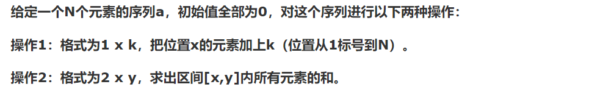

# CDQ分治

## 基本思想



这是树状数组/线段树的基本操作，如何用cdq分治来做呢？

见下面例题1


**例题1**       洛谷P3374 

树状数组模板题，单点修改，区间询问和

这里使用cdq分治求解

```c++
// luogu-judger-enable-o2
#include<bits/stdc++.h>
using namespace std;
typedef long long ll;

const int maxn=5e5+10;
const int maxm=5e5+10;
const int maxq=maxn+(maxm<<1);

struct node{
    int type;
    ll val;
    int id;
    bool operator < (const node & rhs) const{
        return id == rhs.id ? type < rhs.type : id < rhs.id;
    }
}no[maxq];

ll ans[maxq];

node tmp[maxq];

void cdq(int L,int R){
    if(L==R) return ;
    int M=(L+R)>>1;
    cdq(L,M);
    cdq(M+1,R);
    ll sum=0;
    int l=L,r=M+1;
    int tid=1;
    while( l<=M  && r<=R  ){
        if(no[l] < no[r]){
            if(no[l].type==1){
                sum+=no[l].val;
            }
            tmp[tid++]=no[l++];
        }
        else{
            if(no[r].type==2){
                ans[no[r].val]-=sum;
            }
            else if(no[r].type==3){
                ans[no[r].val]+=sum;
            }
            tmp[tid++]=no[r++];
        }
    }
    while(l<=M){
        tmp[tid++]=no[l++];
    }
    while(r<=R){
        if(no[r].type==2){
                ans[no[r].val]-=sum;
            }
            else if(no[r].type==3){
                ans[no[r].val]+=sum;
        }
        tmp[tid++]=no[r++];
    }
    for(int i=L;i<=R;++i){
        no[i]=tmp[i-L+1];
    }
}

int main()
{
    int idx=1;
    int aid=1;
    int n,m;
    scanf("%d%d",&n,&m);
    for(int i=1;i<=n;++i){
        no[idx].type=1;
        no[idx].id=i;
        scanf("%lld",&no[idx++].val);
    }
    for(int i=1;i<=m;++i){
        int type;
        scanf("%d",&type);
        if(type==1){
            scanf("%d%lld",&no[idx].id,&no[idx].val);
            no[idx].type=1;
            idx++;
        }
        else{
            int l,r;
            scanf("%d%d",&l,&r);
            no[idx].type=2;
            no[idx].id=l-1;
            no[idx].val=aid;
            idx++;
            no[idx].type=3;
            no[idx].id=r;
            no[idx].val=aid++;
            idx++;
        }
    }
    //for(int i=1;i<idx;++i) cout<<no[i].id<<" "<<no[i].type<<" "<<no[i].val<<endl;
    cdq(1,idx-1);
    for(int i=1;i<aid;++i) printf("%lld\n",ans[i]);
    return 0;
}
```


**例题2**    **bzoj3262**

裸题  三维偏序问题 注意可能有重点 去下重即可

```c++
//bzoj 3262
#include<bits/stdc++.h>
using namespace std;
typedef long long ll;
const int maxn=200000;
int node[maxn+10];//权值
int ans[maxn/2+10];//本题要求
int up;
struct flower{
    int x,y,z,ans,cnt;//注意ans 和 cnt要带在结构体里
}flo[maxn/2+10];
inline int lowbit(int x)
{
    return (x&-x);
}
void add(int x,int value)
{
    for(int i=x;i<=up;i+=lowbit(i))
        node[i]+=value;
}
int get(int x)
{
    int sum=0;
    for(int i=x;i;i-=lowbit(i))
        sum+=node[i];
    return sum;
}
bool cmp(const flower &a,const flower &b)
{
    return a.y < b.y;
}

bool cmp2(const flower &a,const flower &b)
{
    if(a.x==b.x){
        if(a.y==b.y) return a.z<b.z;
        return a.y<b.y;
    }
    return a.x < b.x;
}
void cdq(int l,int r)
{
    if(l==r){
        flo[l].ans+=flo[l].cnt-1;
        return ;
    }
    int mid=(l+r)>>1;
    cdq(l,mid);
    cdq(mid+1,r);
    sort(flo+l,flo+mid+1,cmp);//其实可以线性排序
    sort(flo+mid+1,flo+r+1,cmp);
    int j=l;
    for(int i=mid+1;i<=r;++i){
        for(;j<=mid && flo[j].y<=flo[i].y;++j){
            add(flo[j].z,flo[j].cnt);
        }
        flo[i].ans+=get(flo[i].z);
    }
    for(int i=l;i<j;++i) add(flo[i].z,-flo[i].cnt);//如果memset肯定会T 也可以申请临时空间 会自动释放
}
int main()
{
    //freopen("in.txt","r",stdin);
    //freopen("out1.txt","w",stdout);
    ios::sync_with_stdio(false);
    cin.tie(0);
    cout.tie(0);
    int n;
    cin>>n>>up;
    for(int i=1;i<=n;++i){
        cin>>flo[i].x>>flo[i].y>>flo[i].z;
    }
    sort(flo+1,flo+n+1,cmp2);
    //对相同的点先进行缩点操作
    int now_id=0;
    for(int i=1;i<=n;++i){
        if(i!=1 && flo[i].x==flo[i-1].x&&flo[i].y==flo[i-1].y&&flo[i].z==flo[i-1].z){
            flo[now_id].cnt++;
        }
        else{
            flo[++now_id]=flo[i];
            flo[now_id].cnt=1;
        }
    }
    cdq(1,now_id);
    for(int i=1;i<=now_id;++i){
        ans[flo[i].ans]+=flo[i].cnt;
    }
    for(int i=0;i<n;++i){
        cout<<ans[i]<<endl;
    }
    return 0;
}
```


**例题3**       [洛谷 P4169](https://www.luogu.org/problemnew/show/P4169)

对于曼哈顿距离 考虑四个方向分别求解，因此现在考虑一个方向如何求解

cdq分治时，左边的修改会对右边的询问产生影响，于是使用树状数组维护。那么具体什么样的左边的点会对右边造成影响呢？当然是两个坐标都小于等于询问辣，那么我们对左边点进行排序（不用sort，自然归并即可），对于询问直接访问树状数组就行啦。


具体维护的是X+Y的最大值

时间复杂度$O(nlog^2n)$     

> 这题时间卡的比较紧 区间最值用线段树会卡掉 所以用树状数组维护

```c++
// luogu-judger-enable-o2
#include<bits/stdc++.h>
using namespace std;
#define lson l,m,rt<<1
#define rson m+1,r,rt<<1|1

int n,m;
const int maxn=3e5+10;
const int maxq=maxn<<1;
const int maxm=2e6+10;
const int inf= 0x3f3f3f3f;
int maxid;

int maxx[maxm<<2];
void Pushup(int rt){
    maxx[rt]=max(maxx[rt<<1],maxx[rt<<1|1]);
}

void cmax(int &x,int y){
    x= x>y? x : y;
}
//
//void build(int l,int r,int rt){
//    if(l==r){
//        maxx[rt]=-inf;
//        return ;
//    }
//    int m=(l+r)>>1;
//    build(lson);build(rson);
//    Pushup(rt);
//}
//
//void update(int p,int cov,int l,int r,int rt){
//    if(l==r){
//        maxx[rt]=cov;
//        return ;
//    }
//    int m=(l+r)>>1;
//    if(p<=m) update(p,cov,lson);
//    else update(p,cov,rson);
//    Pushup(rt);
//}
//
//int query(int L,int R,int l,int r,int rt){
//    if(L<=l && r<=R) return maxx[rt];
//    int m=(l+r)>>1;
//    int ret=-inf;
//    if(L<=m) cmax(ret,query(L,R,lson));
//    if(R>m) cmax(ret,query(L,R,rson));
//    return ret;
//}

int mx[maxm];
int lowbit(int x) { return x&(-x); }
void add(int x,int v){ for(int i=x;i<=maxid;i+=lowbit(i))cmax(mx[i],v);}
int query(int x){ int res=-inf; for(int i=x;i>0;i-=lowbit(i))cmax(res,mx[i]); return res;}
void cls(int x){ for(int i=x;i<=maxid;i+=lowbit(i))mx[i]=-inf;}


struct node{
    int x,y;
    int type;
    int id;
    bool operator < (const node & rhs) const{
        return x == rhs.x ? y<= rhs.y  :  x <= rhs.x ;
    }
}no[maxq];
int ans[maxq];

node tmp[maxq];
node tmp2[maxq];

void cdq(int L,int R)
{
    if(L==R) return ;
    int M=(L+R)>>1;
    cdq(L,M);cdq(M+1,R);
    int l=L,r=M+1;
    int tid=1;
    while(l<=M && r<=R){
        if(no[l]<no[r]){
            if(no[l].type==1){
                //update(no[l].y,no[l].y+no[l].x,1,maxid,1);
                add(no[l].y,no[l].x+no[l].y);
            }
            tmp[tid++]=no[l++];
        }
        else{
            //    cout<<query(1,no[r].y,1,maxid,1)<<endl;
            if(no[r].type==2) {
                //ans[no[r].id]=min(ans[no[r].id],no[r].x+no[r].y-query(1,no[r].y,1,maxid,1));
                ans[no[r].id]=min(ans[no[r].id],no[r].x+no[r].y-query(no[r].y));
            }
            tmp[tid++]=no[r++];
        }
    }
    while(l<=M){
        tmp[tid++]=no[l++];
    }
    while(r<=R){
        if(no[r].type==2){
            //ans[no[r].id]=min(ans[no[r].id],no[r].x+no[r].y-query(1,no[r].y,1,maxid,1));
            ans[no[r].id]=min(ans[no[r].id],no[r].x+no[r].y-query(no[r].y));
        }
        tmp[tid++]=no[r++];
    }
    for(int i=L;i<=M;++i){
        if(no[i].type==1) {
            //update(no[i].y,-inf,1,maxid,1);
            cls(no[i].y);
        }
    }
    for(int i=L;i<=R;++i) no[i]=tmp[i-L+1];
}

int main()
{
 //   freopen("in.txt","r",stdin);
    maxid=0;
    memset(mx,-inf,sizeof(mx));
    int idx=1;
    int aid=1;
    scanf("%d%d",&n,&m);
    for(int i=1;i<=n;++i){
        scanf("%d%d",&no[idx].x,&no[idx].y);
        no[idx].x++;
        no[idx].y++;
        maxid=max(maxid,no[idx].x);
        maxid=max(maxid,no[idx].y);
        no[idx++].type=1;
    }
    for(int i=1;i<=m;++i){
        int type;
        scanf("%d",&type);
        if(type==1){
            no[idx].type=1;
            scanf("%d%d",&no[idx].x,&no[idx].y);
            no[idx].x++;
            no[idx].y++;
            maxid=max(maxid,no[idx].x);
            maxid=max(maxid,no[idx].y);
            idx++;
        }
        else{
            no[idx].type=2;
            scanf("%d%d",&no[idx].x,&no[idx].y);
            no[idx].x++;
            no[idx].y++;
            maxid=max(maxid,no[idx].x);
            maxid=max(maxid,no[idx].y);
            no[idx].id=aid;
            aid++;
            idx++;
        }
    }
    for(int i=1;i<idx;++i) tmp2[i]=no[i];
    for(int i=1;i<aid;++i) ans[i]=inf;
    maxid+=1;
    //build(1,maxid,1);
    cdq(1,idx-1);
    for(int i=1;i<idx;++i) tmp2[i].x=maxid-tmp2[i].x,no[i]=tmp2[i];
    cdq(1,idx-1);
    for(int i=1;i<idx;++i) tmp2[i].y=maxid-tmp2[i].y,no[i]=tmp2[i];
    cdq(1,idx-1);
    for(int i=1;i<idx;++i) tmp2[i].x=maxid-tmp2[i].x,no[i]=tmp2[i];
    cdq(1,idx-1);
    for(int i=1;i<aid;++i){
         printf("%d\n",ans[i]);
    }
    return 0;
}
```

