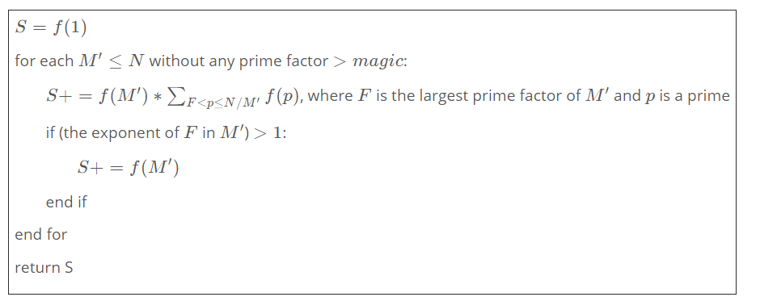
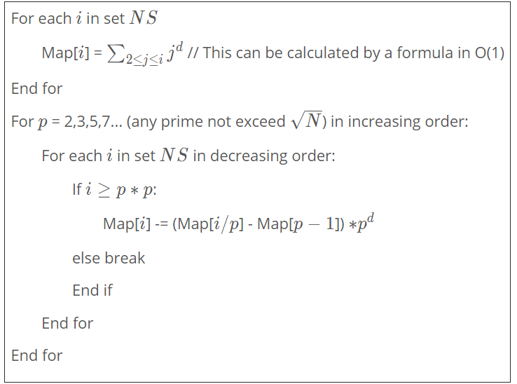

## Extended Eratosthenes Sieve   [参考链接](https://www.spoj.com/problems/TEES/tdsourcetag=s_pctim_aiomsg)

给出一个积性函数(一些非积性函数也可以搞一搞)$f$，且$f(p)$为关于$p$的多项式。求$S(n)=\sum_{i=1}^nf(i)$

$\forall  \ 2\le i\le n$，我们可以将$i​$分为两类

* 最大质因子的幂次=1，则其次大质因子$< \sqrt{n}$
* 最大质因子的幂次$>$1 ，则其最大质因子$\le \sqrt{n}$

初始化$S(n)=f(1)$ 

**枚举所有质因子$\le\sqrt{n}$的数$k$，设其最大质因子为$L$，则$S(n)+=f(k)\cdot\sum_{L<p\le \frac n k}f(p) \quad p \ is \ prime $，此时每个$k\cdot p$都对应第一类数；**

**另外，若$k​$的最大质因子次幂$>1​$，$S(n)+=f(k)​$，此时$k​$就是一个第二类数。**

伪代码如下：	




* 如果我们$dfs$质因子来得到每个$k$，通常可以由积性函数的定义与性质简单地计算出$f(k)$。另外需要注意的是，如果$L>\frac n k$，则继续递归对答案的贡献为0，此时需要及时break，否则影响时间复杂度
* 如果我们可以$O(1)$地求出$\sum_{L<p\le \frac n k}f(p)$，那么上面过程的时间复杂度是$O(满足kL< n的k的个数)$，当$n\le 10^{13}$时，时间复杂度为$O(\frac {n^{\frac 3 4}}{ log n})$ 

* 设$g(i)=\sum_{1\le p\le i}f(p)$   ，现在问题只剩下了求$\sum_{L<p\le \frac n k}f(p)=g(\lfloor \frac n k\rfloor)-g(L)$   。 由于$\lfloor \frac n k\rfloor$只有$O(\sqrt{n})$种，$L\le \sqrt{n}$也只有$O(\sqrt{n})$种，因此我们只需要计算$g$的$O(\sqrt{n})$项。

* 在题设里提到了$f(p)$是一个关于$p$的多项式，即$f(p)=\sum a_ip^{k_i} \quad p \ is \ prime$ ，我们对于每个$i$，假设$f(p)=p^{k_i}$，最后乘上系数累加就可以得到$ans$
* 现在的问题是求$g(i)=\sum_{1\le p\le i}f(p)$，注意这里$p$是素数，因此$f$的非质数项的结果是不影响答案的，我们强行规定$f(n)=n^{k_i}$使得$f$成为一个完全积性函数。


计算$g(i)$的伪代码：




* 对于每个我们可能用到的$g(i)$，我们只会在遍历不超过$\sqrt{n}$的质数时访问到，因此每个$i$贡献的时间复杂度为$O(\frac {\sqrt{i} }{log\sqrt{i}})=O(\frac {\sqrt{i} }{logi})$  


* 


**例题1**  [DIVCNTK](https://www.spoj.com/problems/DIVCNTK/)

定义$\sigma(n)=n的因子数$  ，求$\sum_{i=1}^n\sigma(i^k)  \ mod  \ 2^{64}   \quad \ n,k \ 1e10$        

```c++
//SPOJ  DIVCNTK - Counting Divisors (general)
//Author : Feynman1999   9.27.2018
//f(1)=1
//f(p)=k+1
//f(p^e)=ek+1
#include<bits/stdc++.h>
using namespace std;
typedef unsigned long long u64;
u64 n,M,k;
//pre预处理后是2~i的p^0的和  p是素数
//hou是2~n/i的p^0的和
//同理，一个题目可能出现p^1 p^2等需要维护
vector<u64> pre,hou,primes;

// 这里res是n/枚举的数
u64 dfs(u64 res, int last, u64 f){
    //最大质因子是prime[last-1] 但将1放在外面值显然一样
    u64 t=(res > M ? hou[n/res] : pre[res])-pre[primes[last]-1];
    u64 ret= t*f*(k+1);//这里需修改
    for(int i=last;i<(int) primes.size();++i){
        int p = primes[i];
        if((u64)p*p > res) break;
        for(u64 q=p,nres=res,nf=f*(k+1);q*p<=res;q*=p){//nf需修改
            ret += dfs (nres/=p,i+1,nf);//枚举更大的数
            nf += f*k;//继续枚举当前素数，指数大于1时，指数每加1，nf+=f*k  ,k是系数
            ret += nf;//指数大于1时，记上贡献
        }
    }
    return ret;
}
u64 solve(u64 n){
    M=sqrt(n);
    pre.clear();pre.resize(M+1);
    hou.clear();hou.resize(M+1);
    primes.clear();primes.reserve(M+1);
    for(int i=1;i<=M;++i){
        pre[i]=i-1;
        hou[i]=n/i-1;
    }
    for(int p=2;p<=M;++p){
        if(pre[p]==pre[p-1]) continue;
        primes.push_back(p);
        const u64 q=(u64)p*p,m=n/p,pnt=pre[p-1];
        const int mid=M/p;
        const int End=min((u64)M,n/q);
        for(int i=1;i<=mid;++i) hou[i]-=hou[i*p]-pnt;
        for(int i=mid+1;i<=End;++i) hou[i]-=pre[m/i]-pnt;
        for(int i=M;i>=q;--i) pre[i]-=pre[i/p]-pnt;
    }
    primes.push_back(M+1);
    return n>1 ? 1+dfs(n,0,1) : 1;
}
int main()
{
    //freopen("in.txt","r",stdin);
    ios::sync_with_stdio(false);
    int t;
    cin>>t;
    while(t--)
    {
        cin>>n>>k;
        cout<<solve(n)<<endl;
    }
    return 0;
}
```


**例题2  **    [神犇和蒟蒻](https://www.lydsy.com/JudgeOnline/problem.php?id=4916)     


`1<=N<=1E9`   答案mod 1e9+7

显然A=1，我们只要计算B

```c++
//phi(1^2)=1
//phi(p^2)=p^2-p
//phi((p^e)^2)=phi((p^{e-1})^2)*p*p;
#include<bits/stdc++.h>
using namespace std;
typedef long long ll;
const int mod=1e9+7;
const int ni6=166666668;
const int ni2=500000004;
ll n,M;
vector<int> pre[3],hou[3],primes;

inline int add(const int x, const int v) {
    return x + v >= mod ? x + v - mod : x + v;
}
inline int dec(const int x, const int v) {
    return x - v < 0 ? x - v + mod : x - v;
}

//这里res是n/枚举的数
int dfs(ll res, int last, ll f){
    //最大质因子是prime[last-1] 但将1放在外面值显然一样
    int t=dec((res > M ? hou[2][n/res] : pre[2][res]),pre[2][primes[last]-1]);
    int ret= (ll)t*f%mod;//这里需修改
    for(int i=last;i<(int) primes.size();++i){
        int p = primes[i];
        if((ll)p*p > res) break;
        const int p2=(ll)p*p%mod;
        for(ll q=p,nres=res,nf=f*p%mod*(p-1)%mod;q*p<=res;q*=p){//nf需修改
            ret = add(ret,dfs(nres/=p,i+1,nf));//枚举更大的数
            nf = nf*p2%mod;//继续枚举当前素数，指数大于1时，指数每加1,nf=nf*p*p;
            ret =add(ret,nf);//指数大于1时，记上贡献
        }
    }
    return ret;
}

inline int ff(ll x){
    x%=mod;
    return x*(x+1)%mod*ni2%mod;
}

inline int fff(ll x){
    x%=mod;
    return x*(x+1)%mod*(2*x+1)%mod*ni6%mod;
}

int solve(ll n){
    M=sqrt(n);
    for(int i=0;i<3;++i){
        pre[i].clear();pre[i].resize(M+1);
        hou[i].clear();hou[i].resize(M+1);
    }
    primes.clear();primes.reserve(M+1);
    for(int i=1;i<=M;++i){
        pre[0][i]=i-1;
        hou[0][i]=(n/i-1)%mod;
        pre[1][i]=dec(ff(i),1);;
        hou[1][i]=dec(ff(n/i),1);
        pre[2][i]=dec(fff(i),1);
        hou[2][i]=dec(fff(n/i),1);
    }
    for(int p=2;p<=M;++p){
        if(pre[0][p]==pre[0][p-1]) continue;
        primes.push_back(p);
        const ll q=(ll)p*p,m=n/p;
        const int pnt0=pre[0][p-1],pnt1=pre[1][p-1],pnt2=pre[2][p-1];
        const int mid=M/p;
        const int End=min((ll)M,n/q);
        for(int i=1;i<=mid;++i){
            hou[0][i]=dec(hou[0][i],dec(hou[0][i*p],pnt0));
            hou[1][i]=dec(hou[1][i],dec(hou[1][i*p],pnt1)*(ll)p%mod);
            hou[2][i]=dec(hou[2][i],dec(hou[2][i*p],pnt2)*q%mod);
        }
        for(int i=mid+1;i<=End;++i){
            hou[0][i]=dec(hou[0][i],dec(pre[0][m/i],pnt0));
            hou[1][i]=dec(hou[1][i],dec(pre[1][m/i],pnt1)*(ll)p%mod);
            hou[2][i]=dec(hou[2][i],dec(pre[2][m/i],pnt2)*q%mod);
        }
        for(int i=M;i>=q;--i){
            pre[0][i]=dec(pre[0][i],dec(pre[0][i/p],pnt0));
            pre[1][i]=dec(pre[1][i],dec(pre[1][i/p],pnt1)*(ll)p%mod);
            pre[2][i]=dec(pre[2][i],dec(pre[2][i/p],pnt2)*q%mod);
        }
    }
    //cout<<clock()<<endl;
    primes.push_back(M+1);
    for (int i = 1; i <= M; i++) {
        pre[2][i] = dec(pre[2][i], pre[1][i]);//p^2-p
        hou[2][i] = dec(hou[2][i], hou[1][i]);
    }
    return n>1 ? add(dfs(n,0,1),1) : 1;
}

int main()
{
    //freopen("in.txt","r",stdin);
    ios::sync_with_stdio(false);
    cin>>n;
    cout<<1<<endl;
    cout<<solve(n)<<endl;
    return 0;
}
```


**例题3**     [APS2](https://www.spoj.com/problems/APS2/)              `一道不是积性函数的题，说明了非积性函数的可行性` 

定义$f(n)=n的最小质因子$，求$\sum_{i=1}^nf(i)   \ mod \ 2^{64}$     ,$1≤N≤1234567891011$   

```c++
//SPOJ  DIVCNTK - Counting Divisors (general)
//f(1)=0
//f(p)=p
//f(p^e)=p
#include<bits/stdc++.h>
using namespace std;
typedef unsigned long long u64;
u64 n,M;
vector<u64> pre[2],hou[2],primes;
u64 ff(u64 A, u64 B){
	return (A+B)%2?(B-A+1)/2*(A+B):(A+B)/2*(B-A+1);
}
u64 dfs(u64 res, int last, u64 f){
    u64 ret,t;
    if(f>0){
		t = (res > M ? hou[0][n/res] : pre[0][res]) - pre[0][primes[last]-1];//有多少个素数
		//直接-id也行   因为pre[0][primes[last]-1]=id
		ret = t * f * 1;//每个的权值这里就是f
	}
	else ret = hou[1][1];//第一次f=0  计算所有的素数的贡献
    for(int i=last;i<(int) primes.size();++i){
        int p = primes[i];
        if((u64)p*p > res) break;
        for(u64 q=p,nres=res,nf=(f==0?p:f);q*p<=res;q*=p){//f==0表明初始化
            ret += dfs (nres/=p,i+1,nf);
            ret += nf;//f==0 nf就是p  否则就是f
        }
    }
    return ret;
}
u64 solve(u64 n){
    M=sqrt(n);
    for(int i=0;i<2;++i){
        pre[i].clear();pre[i].resize(M+1);
        hou[i].clear();hou[i].resize(M+1);
    }
    primes.clear();primes.reserve(M+1);
    for(int i=1;i<=M;++i){
        pre[0][i]=i-1;
        pre[1][i]=ff(2,i);
        hou[0][i]=n/i-1;
        hou[1][i]=ff(2,n/i);
    }
    for(int p=2;p<=M;++p){
        if(pre[0][p]==pre[0][p-1]) continue;
        primes.push_back(p);
        const u64 q=(u64)p*p,m=n/p,pnt0=pre[0][p-1],pnt1=pre[1][p-1];
        const int mid=M/p;
        const int End=min((u64)M,n/q);
        for(int i=1;i<=mid;++i){
            hou[0][i]-=hou[0][i*p]-pnt0;
            hou[1][i]-=(hou[1][i*p]-pnt1)*p;
        }
        for(int i=mid+1;i<=End;++i){
            hou[0][i]-=pre[0][m/i]-pnt0;
            hou[1][i]-=(pre[1][m/i]-pnt1)*p;
        }
        for(int i=M;i>=q;--i){
            pre[0][i]-=pre[0][i/p]-pnt0;
            pre[1][i]-=(pre[1][i/p]-pnt1)*p;
        }
    }
    primes.push_back(M+1);
    return n>1 ? dfs(n,0,0) : 0;
}
int main()
{
    //freopen("in.txt","r",stdin);
    ios::sync_with_stdio(false);
    int t;
    cin>>t;
    while(t--)
    {
        cin>>n;
        cout<<solve(n)<<endl;
    }
    return 0;
}
```


**例题4**      https://projecteuler.net/problem=642

定义$f(n)=n的最大质因子$，求$\sum_{i=1}^nf(i)   \ mod \ 1e9$     ,$1≤N≤201820182018$   


```c++
// PE 642  最大质因子 前缀和
// author : Feynman1999
// f(1)=0   f(p)=p   f(p^e)=p
// running time: 12.8s    using Intel I5-3470
#include<bits/stdc++.h>
using namespace std;
typedef long long ll;
const int mod=1e9;
ll n,M;
vector<ll> pre[2],hou[2],primes;
ll ff(ll A, ll B){
	return (A+B)%2?(B-A+1)/2%mod*((A+B)%mod)%mod:(A+B)/2%mod*((B-A+1)%mod)%mod;
}
ll dfs(ll res, int last, int f){
    ll ret;
    if(f>0) ret =((res > M ? hou[1][n/res] : pre[1][res]) - pre[1][primes[last]-1]+mod)%mod;
	else ret = hou[1][1];
    for(int i=last;i<(int) primes.size();++i){
        int p = primes[i];
        if((ll)p*p > res) break;
        for(ll q=p,nres=res;q*p<=res;q*=p){
            ret =(ret + dfs(nres/=p,i+1,p))%mod ;
            ret =(ret + p)%mod;
        }
    }
    return ret;
}
ll solve(ll n){
    M=sqrt(n);
    for(int i=0;i<2;++i){
        pre[i].clear();pre[i].resize(M+1);
        hou[i].clear();hou[i].resize(M+1);
    }
    primes.clear();primes.reserve(M+1);
    for(int i=1;i<=M;++i){
        pre[0][i]=i-1;
        pre[1][i]=ff(2,i);
        hou[0][i]=(n/i-1)%mod;
        hou[1][i]=ff(2,n/i);
    }
    for(int p=2;p<=M;++p){
        if(pre[0][p]==pre[0][p-1]) continue;
        primes.push_back(p);
        const ll q=(ll)p*p,m=n/p,pnt0=pre[0][p-1],pnt1=pre[1][p-1];
        const int mid=M/p;
        const int End=min((ll)M,n/q);
        for(int i=1;i<=mid;++i){
            hou[0][i]=(hou[0][i]-(hou[0][i*p]-pnt0))%mod;
            hou[1][i]=(hou[1][i]-(hou[1][i*p]-pnt1)*p%mod)%mod;
        }
        for(int i=mid+1;i<=End;++i){
            hou[0][i]=(hou[0][i]-(pre[0][m/i]-pnt0))%mod;
            hou[1][i]=(hou[1][i]-(pre[1][m/i]-pnt1)*p%mod)%mod;
        }
        for(int i=M;i>=q;--i){
            pre[0][i]=(pre[0][i]-(pre[0][i/p]-pnt0))%mod;
            pre[1][i]=(pre[1][i]-(pre[1][i/p]-pnt1)*p%mod)%mod;
        }
    }
    primes.push_back(M+1);
    return n>1 ? dfs(n,0,0) : 0;
}
int main()
{
    ios::sync_with_stdio(false);
    cin>>n;
    cout<<(solve(n)%mod+mod)%mod<<endl<<endl;
    return 0;
}
```

